# 🔧 Secure Git and Grafana Monitoring Platform with Authelia SSO

This project sets up a **secure, containerized Git service (Gitea)**, **monitoring with Grafana**, and **Single Sign-On (SSO) using Authelia**, all routed through a **reverse proxy** (Nginx). The infrastructure is provisioned via Terraform, and containerized using Docker Compose.

---

## Features Implemented

1. **Gitea** - Self-hosted Git service
2. **Grafana** - Monitoring and data visualization
3. **Authelia** - Single Sign-On (SSO) provider
4. **Reverse Proxy** - Nginx (with integrated Authelia support)
5. **Dockerized Services** - All components run in containers via Docker Compose
6. **Terraform IAC** - Reusable and idempotent infrastructure provisioning
7. **Loki** - Log aggregation and visualization in Grafana
---

## Architecture Overview
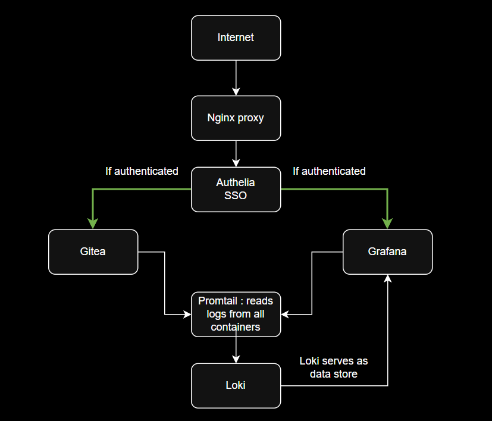

---

## Prerequisites

- AWS EC2 instance (Linux)
- Docker & Docker Compose
- Terraform
- Open Security Group ports: `80`, `443`.
- AWS CLI

---

## Setup Instructions

### 1. Clone the Repository

```bash
git clone https://github.com/Amisha-Gouda/gitea-grafana-authelia-sso-secure.git
cd gitea-grafana-authelia-sso-secure
```

### 2. Generate Self-Signed SSL Certificates for HTTPS
#### Authelia SSL Certificate
```bash
openssl req -x509 -nodes -days 365 \
  -newkey rsa:2048 \
  -keyout ./nginx/certs/authelia.key \
  -out ./nginx/certs/authelia.pem \
  -subj "/CN=authelia.mytest.local"
```
#### Gitea SSL Certificate
```bash
openssl req -x509 -nodes -days 365 \
  -newkey rsa:2048 \
  -keyout ./nginx/certs/gitea.key \
  -out ./nginx/certs/gitea.pem \
  -subj "/CN=gitea.mytest.local"
```

#### Grafana SSL Certificate
```bash
openssl req -x509 -nodes -days 365 \
  -newkey rsa:2048 \
  -keyout ./nginx/certs/grafana.key \
  -out ./nginx/certs/grafana.pem \
  -subj "/CN=grafana.mytest.local"
```

### 3. Configure AWS CLI Access
```bash
Before running Terraform, you need to configure your AWS credentials using an Access Key and Secret Key.
2.1  Generate Access Key & Secret Key
    - Navigate to: My Security Credentials → Access Keys → Create access key
    - Download or copy the Access Key ID and Secret Access Key
2.2 Then configure using: aws configure
```

### 4. Before initializing Terraform, we’ll create an S3 bucket to hold the Terraform state file.
#### 4.1 Create the S3 Bucket via AWS CLI
```bash
aws s3api create-bucket \
  --bucket <your-bucket-name> \
  --region <your-region>
```
#### 4.2 Then ensure your terraform/backend.tf is updated with your S3 bucket. It should look like this:
```bash
terraform {
  backend "s3" {
    bucket         = <your-bucket-name>
    key            = "terraform.tfstate"
    region         = <your-region>
    encrypt        = true
  }
}
```

### 5. Provision Infrastructure (Terraform)

```bash
cd terraform
terraform init
terraform plan
terraform apply
```

### 6. Local DNS Configuration
```bash
To access services via custom domain names, add these entries to your `/etc/hosts` file:
<your-ec2-ip>   gitea.mytest.local grafana.mytest.local authelia.mytest.local
```

### 7. Access URLS
```bash
🌐 Gitea: http://gitea.mytest.local
📊 Grafana: http://grafana.mytest.local
🔐 Authelia: http://authelia.mytest.local
```

### 8. Results:

#### 8.1 Gitea 
- Access via `http://gitea.mytest.local`
- Protected by SSO via Authelia
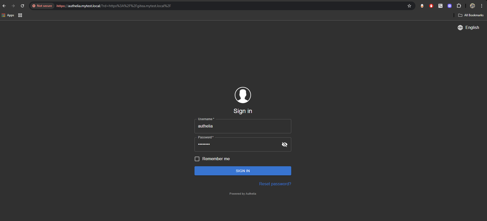
- Hosted Git repositories
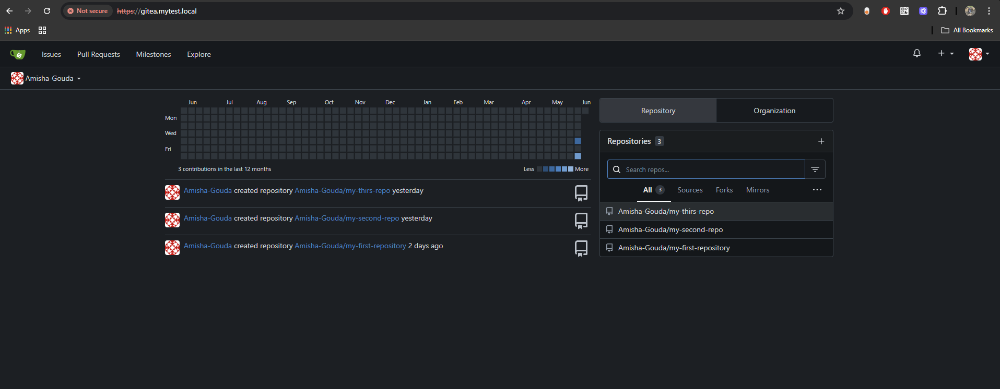

#### 8.2 Grafana
- Access via `http://grafana.mytest.local`
- Protected by SSO via Authelia
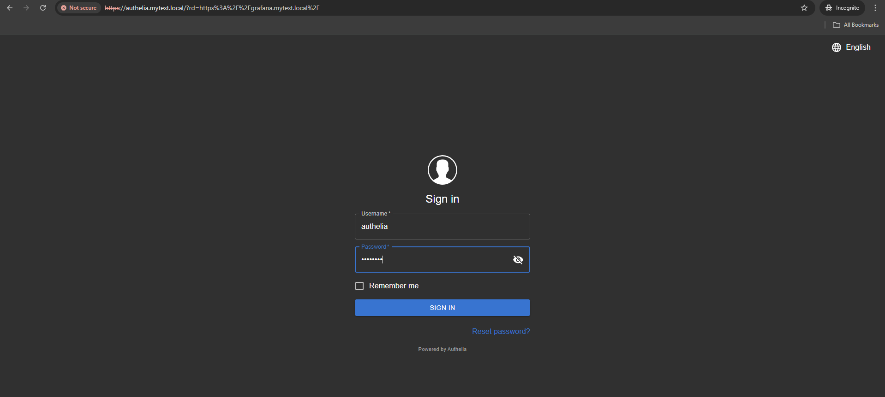
- Real-time monitoring of system health
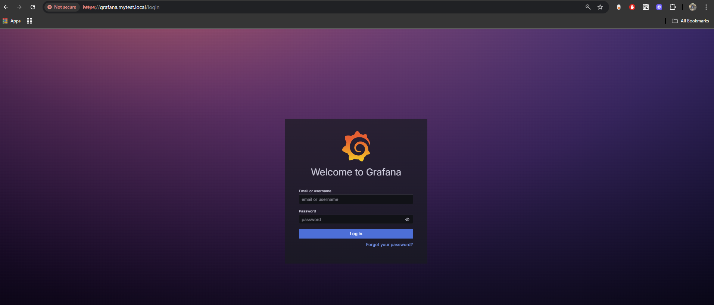
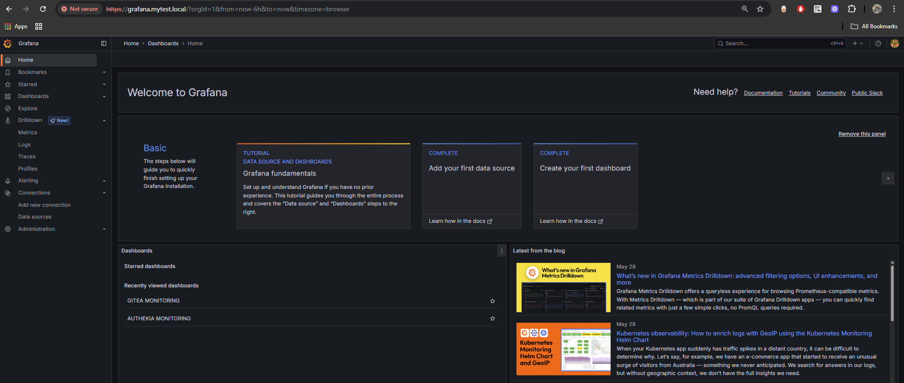
- Integrated Loki data source for log streaming
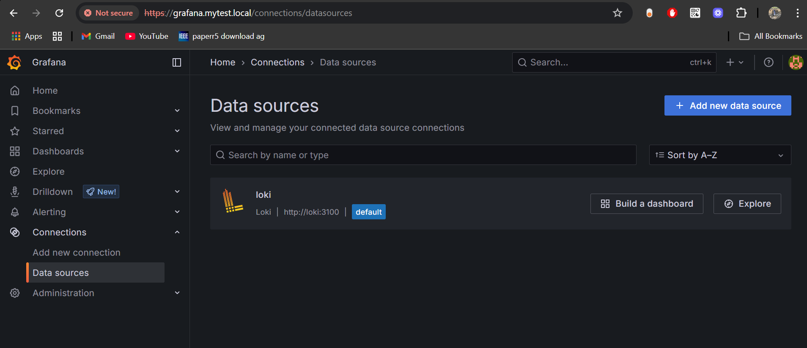
- Gitea and Authelia monitoring dashboards
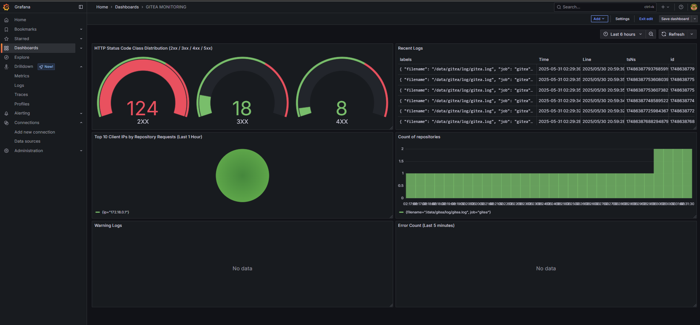
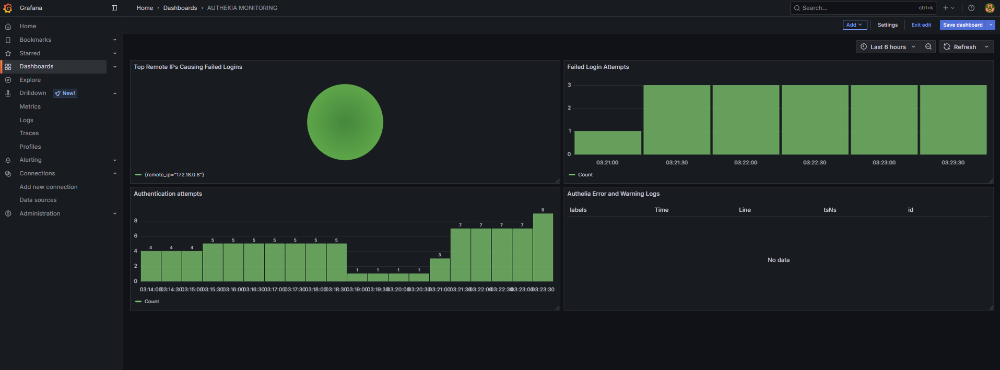

#### 8.3 Authelia SSO
- Handles authentication for Gitea and Grafana
- Accessible at `http://authelia.mytest.local`
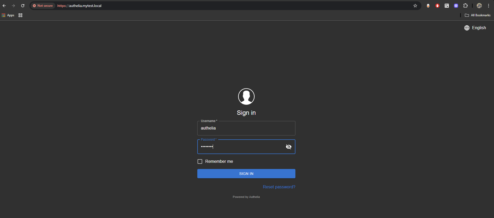
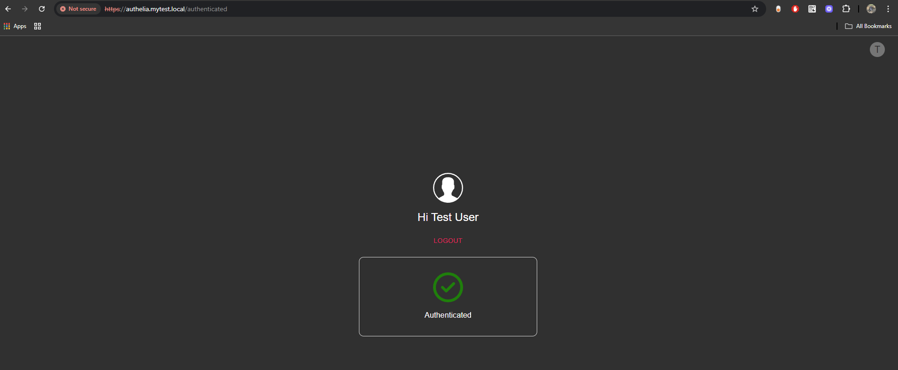

## Need Help?

If you encounter any issues during setup or usage, please refer to the [Troubleshooting Guide](./troubleshooting.md) for common problems and solutions.